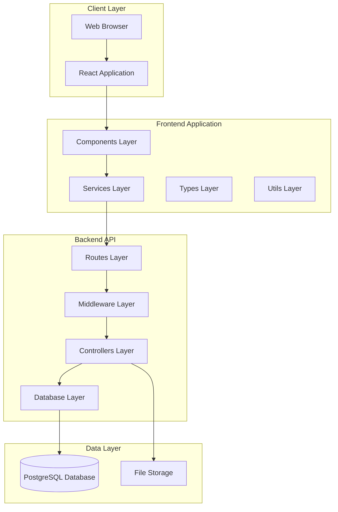
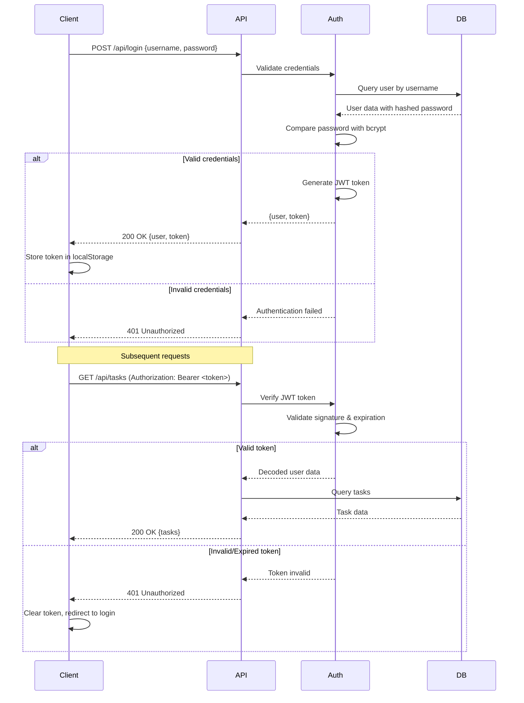

# Design Document: Intersite Track

## Overview

Intersite Track (formerly TaskAm) is a task management system for organizations that requires significant refactoring to improve code organization, enhance UI/UX, and prepare for production deployment. The current implementation suffers from monolithic file structures with App.tsx exceeding 1000 lines and server.ts containing all API routes in a single file.

This design addresses the core architectural challenges by:

1. **Frontend Deconstruction**: Breaking down the monolithic App.tsx into modular, reusable components organized by feature
2. **Backend Restructuring**: Separating concerns into Routes, Controllers, and Database layers following MVC patterns
3. **Security Enhancement**: Implementing industry-standard authentication using JWT and bcrypt/argon2
4. **Typography System**: Establishing consistent, readable typography across the application
5. **Deployment Readiness**: Configuring the application for Vercel serverless deployment
6. **Code Quality**: Removing dead code, applying consistent formatting, and ensuring type safety

The refactored architecture will maintain all existing functionality while providing a scalable foundation for future development.

## Architecture

### High-Level Architecture



### Frontend Architecture

The frontend will be organized into a feature-based structure:

```
src/
├── components/
│   ├── common/          # Shared UI components
│   │   ├── Button.tsx
│   │   ├── Modal.tsx
│   │   ├── Input.tsx
│   │   └── Card.tsx
│   ├── layout/          # Layout components
│   │   ├── Sidebar.tsx
│   │   ├── Header.tsx
│   │   └── MainLayout.tsx
│   ├── auth/            # Authentication components
│   │   ├── LoginForm.tsx
│   │   └── ProfileModal.tsx
│   ├── dashboard/       # Dashboard feature
│   │   ├── DashboardPage.tsx
│   │   ├── StatCard.tsx
│   │   └── UpcomingTasks.tsx
│   ├── tasks/           # Task management feature
│   │   ├── TasksPage.tsx
│   │   ├── TaskCard.tsx
│   │   ├── TaskDetailModal.tsx
│   │   ├── TaskFormModal.tsx
│   │   └── TaskFilters.tsx
│   ├── staff/           # Staff management feature
│   │   ├── StaffPage.tsx
│   │   ├── StaffTable.tsx
│   │   └── UserFormModal.tsx
│   ├── reports/         # Reports feature
│   │   ├── ReportsPage.tsx
│   │   └── StaffReportTable.tsx
│   ├── notifications/   # Notifications feature
│   │   ├── NotificationsPage.tsx
│   │   └── NotificationItem.tsx
│   └── settings/        # Settings feature
│       ├── SettingsPage.tsx
│       ├── DepartmentSettings.tsx
│       └── TaskTypeSettings.tsx
├── services/
│   ├── api.ts           # Base API client
│   ├── authService.ts   # Authentication API calls
│   ├── taskService.ts   # Task API calls
│   ├── userService.ts   # User API calls
│   ├── notificationService.ts
│   └── reportService.ts
├── types/
│   ├── index.ts         # Re-exports all types
│   ├── user.ts
│   ├── task.ts
│   ├── notification.ts
│   └── common.ts
├── utils/
│   ├── formatters.ts    # Date, text formatting
│   ├── constants.ts     # App constants
│   └── validators.ts    # Input validation
├── hooks/
│   ├── useAuth.ts       # Authentication hook
│   ├── useTasks.ts      # Task management hook
│   └── useNotifications.ts
├── App.tsx              # Main app component (< 200 lines)
├── main.tsx             # Entry point
└── index.css            # Global styles
```

### Backend Architecture

The backend will follow a layered architecture pattern:

```
server/
├── index.ts             # Server entry point (< 100 lines)
├── config/
│   ├── database.ts      # Database connection config
│   ├── environment.ts   # Environment variables
│   └── jwt.ts           # JWT configuration
├── routes/
│   ├── index.ts         # Route aggregator
│   ├── auth.routes.ts   # Authentication routes
│   ├── user.routes.ts   # User management routes
│   ├── task.routes.ts   # Task management routes
│   ├── department.routes.ts
│   ├── taskType.routes.ts
│   ├── notification.routes.ts
│   └── report.routes.ts
├── controllers/
│   ├── auth.controller.ts
│   ├── user.controller.ts
│   ├── task.controller.ts
│   ├── department.controller.ts
│   ├── taskType.controller.ts
│   ├── notification.controller.ts
│   └── report.controller.ts
├── middleware/
│   ├── auth.middleware.ts      # JWT validation
│   ├── error.middleware.ts     # Error handling
│   ├── validation.middleware.ts # Input validation
│   └── rateLimit.middleware.ts # Rate limiting
├── database/
│   ├── connection.ts    # Database pool management
│   ├── init.ts          # Database initialization
│   └── queries/
│       ├── user.queries.ts
│       ├── task.queries.ts
│       ├── notification.queries.ts
│       └── report.queries.ts
├── utils/
│   ├── password.ts      # Password hashing utilities
│   ├── jwt.ts           # JWT utilities
│   └── response.ts      # Response formatting
└── types/
    └── express.d.ts     # Express type extensions
```

## Components and Interfaces

### Frontend Components

#### Core Components

**App.tsx**
- Responsibility: Application shell, routing, and global state management
- Props: None
- State: User authentication state, global loading state
- Size: < 200 lines

**MainLayout.tsx**
- Responsibility: Main application layout with sidebar and header
- Props: `{ children: ReactNode, user: User, onLogout: () => void }`
- Renders: Sidebar, Header, main content area

#### Feature Components

**DashboardPage.tsx**
- Responsibility: Display dashboard with stats and recent tasks
- Props: `{ stats: Stats, tasks: Task[], users: User[], user: User }`
- Integrates: StatCard, TaskCard, UpcomingTasks components

**TasksPage.tsx**
- Responsibility: Task list with filtering and search
- Props: `{ tasks: Task[], users: User[], taskTypes: TaskType[], currentUser: User }`
- Integrates: TaskCard, TaskFilters components

**TaskDetailModal.tsx**
- Responsibility: Display task details, updates, and checklist
- Props: `{ task: Task, user: User, onClose: () => void, onUpdate: () => void }`
- Features: Task updates, checklist management, file attachments

**TaskFormModal.tsx**
- Responsibility: Create/edit task form
- Props: `{ task?: Task, users: User[], taskTypes: TaskType[], onSave: () => void, onClose: () => void }`
- Validation: Title required, date validation, assignee selection

### Frontend Services

#### API Service (api.ts)

```typescript
interface ApiOptions extends RequestInit {
  token?: string;
}

class ApiService {
  private baseURL: string;
  
  async request<T>(endpoint: string, options?: ApiOptions): Promise<T>;
  async get<T>(endpoint: string, options?: ApiOptions): Promise<T>;
  async post<T>(endpoint: string, data: any, options?: ApiOptions): Promise<T>;
  async put<T>(endpoint: string, data: any, options?: ApiOptions): Promise<T>;
  async patch<T>(endpoint: string, data: any, options?: ApiOptions): Promise<T>;
  async delete<T>(endpoint: string, options?: ApiOptions): Promise<T>;
}
```

#### Authentication Service (authService.ts)

```typescript
interface LoginCredentials {
  username: string;
  password: string;
}

interface AuthResponse {
  user: User;
  token: string;
}

class AuthService {
  async login(credentials: LoginCredentials): Promise<AuthResponse>;
  async logout(): Promise<void>;
  async validateToken(token: string): Promise<boolean>;
  getStoredToken(): string | null;
  setToken(token: string): void;
  clearToken(): void;
}
```

#### Task Service (taskService.ts)

```typescript
interface TaskFilters {
  search?: string;
  status?: TaskStatus;
  priority?: TaskPriority;
  assignee?: number;
  dateFrom?: string;
  dateTo?: string;
}

class TaskService {
  async getTasks(filters?: TaskFilters): Promise<Task[]>;
  async getTask(id: number): Promise<Task>;
  async createTask(task: CreateTaskDTO): Promise<{ id: number }>;
  async updateTask(id: number, task: UpdateTaskDTO): Promise<void>;
  async deleteTask(id: number): Promise<void>;
  async updateTaskStatus(id: number, status: TaskStatus, progress: number): Promise<void>;
  async getTaskUpdates(taskId: number): Promise<TaskUpdate[]>;
  async addTaskUpdate(taskId: number, update: CreateTaskUpdateDTO): Promise<void>;
  async getTaskChecklists(taskId: number): Promise<ChecklistItem[]>;
  async saveTaskChecklists(taskId: number, items: ChecklistItem[]): Promise<void>;
}
```

### Backend Controllers

#### Authentication Controller

```typescript
interface AuthController {
  login(req: Request, res: Response, next: NextFunction): Promise<void>;
  validateToken(req: Request, res: Response, next: NextFunction): Promise<void>;
  changePassword(req: Request, res: Response, next: NextFunction): Promise<void>;
}
```

#### Task Controller

```typescript
interface TaskController {
  getTasks(req: Request, res: Response, next: NextFunction): Promise<void>;
  getTask(req: Request, res: Response, next: NextFunction): Promise<void>;
  createTask(req: Request, res: Response, next: NextFunction): Promise<void>;
  updateTask(req: Request, res: Response, next: NextFunction): Promise<void>;
  deleteTask(req: Request, res: Response, next: NextFunction): Promise<void>;
  updateTaskStatus(req: Request, res: Response, next: NextFunction): Promise<void>;
  getTaskUpdates(req: Request, res: Response, next: NextFunction): Promise<void>;
  addTaskUpdate(req: Request, res: Response, next: NextFunction): Promise<void>;
  getTaskChecklists(req: Request, res: Response, next: NextFunction): Promise<void>;
  saveTaskChecklists(req: Request, res: Response, next: NextFunction): Promise<void>;
}
```

### Backend Database Layer

#### Database Connection

```typescript
interface DatabaseConfig {
  host: string;
  port: number;
  database: string;
  user: string;
  password: string;
  max?: number;  // Connection pool size
  idleTimeoutMillis?: number;
  connectionTimeoutMillis?: number;
}

class DatabaseConnection {
  private pool: Pool;
  
  constructor(config: DatabaseConfig);
  async query<T>(sql: string, params?: any[]): Promise<QueryResult<T>>;
  async transaction<T>(callback: (client: PoolClient) => Promise<T>): Promise<T>;
  async close(): Promise<void>;
}
```

#### Query Modules

```typescript
// user.queries.ts
interface UserQueries {
  findByUsername(username: string): Promise<User | null>;
  findById(id: number): Promise<User | null>;
  findAll(): Promise<User[]>;
  create(user: CreateUserDTO): Promise<number>;
  update(id: number, user: UpdateUserDTO): Promise<void>;
  delete(id: number): Promise<void>;
  updatePassword(id: number, hashedPassword: string): Promise<void>;
}

// task.queries.ts
interface TaskQueries {
  findAll(filters?: TaskFilters): Promise<Task[]>;
  findById(id: number): Promise<Task | null>;
  create(task: CreateTaskDTO): Promise<number>;
  update(id: number, task: UpdateTaskDTO): Promise<void>;
  delete(id: number): Promise<void>;
  updateStatus(id: number, status: string, progress: number): Promise<void>;
  getAssignments(taskId: number): Promise<User[]>;
  setAssignments(taskId: number, userIds: number[]): Promise<void>;
}
```

### Middleware

#### Authentication Middleware

```typescript
interface AuthMiddleware {
  verifyToken(req: Request, res: Response, next: NextFunction): Promise<void>;
  requireRole(roles: string[]): (req: Request, res: Response, next: NextFunction) => Promise<void>;
}

// Extends Express Request type
declare global {
  namespace Express {
    interface Request {
      user?: {
        id: number;
        username: string;
        role: string;
      };
    }
  }
}
```

#### Error Middleware

```typescript
interface ErrorResponse {
  error: string;
  message?: string;
  stack?: string;
}

interface ErrorMiddleware {
  notFound(req: Request, res: Response, next: NextFunction): void;
  errorHandler(err: Error, req: Request, res: Response, next: NextFunction): void;
}
```

## Data Models

### User Model

```typescript
interface User {
  id: number;
  username: string;
  first_name: string;
  last_name: string;
  role: "admin" | "staff";
  department_id: number;
  department_name?: string;
  position: string;
  created_at: string;
}

interface CreateUserDTO {
  username: string;
  password: string;
  first_name: string;
  last_name: string;
  role?: "admin" | "staff";
  department_id?: number;
  position?: string;
}

interface UpdateUserDTO {
  username?: string;
  first_name?: string;
  last_name?: string;
  role?: "admin" | "staff";
  department_id?: number;
  position?: string;
}
```

### Task Model

```typescript
type TaskStatus = "pending" | "in_progress" | "completed" | "cancelled";
type TaskPriority = "low" | "medium" | "high" | "urgent";

interface Task {
  id: number;
  title: string;
  description: string;
  task_type_id: number;
  task_type_name?: string;
  priority: TaskPriority;
  status: TaskStatus;
  due_date: string;
  progress: number;
  created_at: string;
  updated_at: string;
  created_by: number;
  creator_name: string;
  assignments: TaskAssignment[];
}

interface TaskAssignment {
  id: number;
  first_name: string;
  last_name: string;
}

interface CreateTaskDTO {
  title: string;
  description?: string;
  task_type_id?: number;
  priority?: TaskPriority;
  due_date?: string;
  created_by: number;
  assigned_user_ids?: number[];
}

interface UpdateTaskDTO {
  title?: string;
  description?: string;
  task_type_id?: number;
  priority?: TaskPriority;
  status?: TaskStatus;
  due_date?: string;
  assigned_user_ids?: number[];
}
```

### Task Update Model

```typescript
interface TaskUpdate {
  id: number;
  task_id: number;
  user_id: number;
  update_text: string;
  progress: number;
  attachment_url?: string;
  created_at: string;
  first_name: string;
  last_name: string;
}

interface CreateTaskUpdateDTO {
  task_id: number;
  user_id: number;
  update_text: string;
  progress: number;
  attachment_url?: string;
}
```

### Checklist Model

```typescript
interface ChecklistItem {
  id?: number;
  task_id?: number;
  parent_id?: number;
  title: string;
  is_checked: boolean;
  sort_order: number;
  children?: ChecklistItem[];
}
```

### Notification Model

```typescript
interface Notification {
  id: number;
  user_id: number;
  title: string;
  message: string;
  type: string;
  reference_id: number;
  is_read: number;
  created_at: string;
}
```

### Database Schema

The existing PostgreSQL schema will be maintained:

```sql
-- Departments table
CREATE TABLE departments (
  id SERIAL PRIMARY KEY,
  name TEXT NOT NULL UNIQUE
);

-- Task types table
CREATE TABLE task_types (
  id SERIAL PRIMARY KEY,
  name TEXT NOT NULL UNIQUE
);

-- Users table
CREATE TABLE users (
  id SERIAL PRIMARY KEY,
  username TEXT NOT NULL UNIQUE,
  password TEXT NOT NULL,  -- Will store bcrypt/argon2 hash
  first_name TEXT,
  last_name TEXT,
  role TEXT CHECK(role IN ('admin', 'staff')) DEFAULT 'staff',
  department_id INTEGER REFERENCES departments(id),
  position TEXT,
  created_at TIMESTAMP DEFAULT CURRENT_TIMESTAMP
);

-- Tasks table
CREATE TABLE tasks (
  id SERIAL PRIMARY KEY,
  title TEXT NOT NULL,
  description TEXT,
  task_type_id INTEGER REFERENCES task_types(id),
  priority TEXT CHECK(priority IN ('low', 'medium', 'high', 'urgent')) DEFAULT 'medium',
  status TEXT CHECK(status IN ('pending', 'in_progress', 'completed', 'cancelled')) DEFAULT 'pending',
  due_date DATE,
  progress INTEGER DEFAULT 0,
  created_at TIMESTAMP DEFAULT CURRENT_TIMESTAMP,
  updated_at TIMESTAMP DEFAULT CURRENT_TIMESTAMP,
  created_by INTEGER REFERENCES users(id)
);

-- Task assignments (many-to-many)
CREATE TABLE task_assignments (
  task_id INTEGER REFERENCES tasks(id) ON DELETE CASCADE,
  user_id INTEGER REFERENCES users(id) ON DELETE CASCADE,
  assigned_at TIMESTAMP DEFAULT CURRENT_TIMESTAMP,
  PRIMARY KEY (task_id, user_id)
);

-- Task updates
CREATE TABLE task_updates (
  id SERIAL PRIMARY KEY,
  task_id INTEGER REFERENCES tasks(id) ON DELETE CASCADE,
  user_id INTEGER REFERENCES users(id),
  update_text TEXT,
  progress INTEGER,
  attachment_url TEXT,
  created_at TIMESTAMP DEFAULT CURRENT_TIMESTAMP
);

-- Notifications
CREATE TABLE notifications (
  id SERIAL PRIMARY KEY,
  user_id INTEGER NOT NULL REFERENCES users(id) ON DELETE CASCADE,
  title TEXT NOT NULL,
  message TEXT NOT NULL,
  type TEXT DEFAULT 'info',
  reference_id INTEGER,
  is_read INTEGER DEFAULT 0,
  created_at TIMESTAMP DEFAULT CURRENT_TIMESTAMP
);

-- Task checklists (hierarchical)
CREATE TABLE task_checklists (
  id SERIAL PRIMARY KEY,
  task_id INTEGER REFERENCES tasks(id) ON DELETE CASCADE,
  parent_id INTEGER,  -- NULL for parent items
  title TEXT NOT NULL,
  is_checked INTEGER DEFAULT 0,
  sort_order INTEGER DEFAULT 0,
  created_at TIMESTAMP DEFAULT CURRENT_TIMESTAMP
);
```

### Database Migration Notes

**Password Migration**: Existing SHA-256 hashed passwords need to be migrated to bcrypt/argon2:
1. Add a `password_version` column to track hash type
2. On user login, detect SHA-256 hash and re-hash with bcrypt
3. Update password_version to indicate new hash type
4. Gradually migrate all passwords through login flow

## Authentication Flow

### JWT-Based Authentication



### JWT Token Structure

```typescript
interface JWTPayload {
  userId: number;
  username: string;
  role: string;
  iat: number;  // Issued at
  exp: number;  // Expiration (24 hours from iat)
}
```

### Password Security

**Hashing Algorithm**: bcrypt with cost factor 10 (or argon2id)

```typescript
// Password hashing
async function hashPassword(password: string): Promise<string> {
  const salt = await bcrypt.genSalt(10);
  return bcrypt.hash(password, salt);
}

// Password verification
async function verifyPassword(password: string, hash: string): Promise<boolean> {
  return bcrypt.compare(password, hash);
}
```

**Password Requirements**:
- Minimum 8 characters
- At least one letter
- At least one number
- No maximum length (bcrypt handles truncation)

### Rate Limiting

Login endpoint will be rate-limited to prevent brute force attacks:
- 5 attempts per IP address per 15 minutes
- 429 Too Many Requests response after limit exceeded
- Exponential backoff for repeated violations

## Typography System

### Font Configuration

**Primary Font Stack**:
```css
font-family: 'Noto Sans Thai', 'Inter', -apple-system, BlinkMacSystemFont, 'Segoe UI', sans-serif;
```

**Rationale**:
- Noto Sans Thai: Excellent Thai character support with consistent weight distribution
- Inter: Modern, readable Latin characters
- System fonts: Fallback for performance

### Font Sizes

```typescript
const typography = {
  // Body text
  xs: '12px',    // Small labels, captions
  sm: '14px',    // Default body text, form inputs
  base: '16px',  // Emphasized body text
  lg: '18px',    // Large body text
  
  // Headings
  xl: '20px',    // H4
  '2xl': '24px', // H3
  '3xl': '30px', // H2
  '4xl': '36px', // H1
  
  // Line heights
  lineHeight: {
    tight: 1.25,
    normal: 1.5,
    relaxed: 1.75,
  }
};
```

### Typography Scale Application

```css
/* Base text - minimum 14px */
body {
  font-size: 14px;
  line-height: 1.5;
  font-family: 'Noto Sans Thai', 'Inter', sans-serif;
}

/* Headings */
h1 { font-size: 36px; line-height: 1.25; font-weight: 700; }
h2 { font-size: 30px; line-height: 1.25; font-weight: 700; }
h3 { font-size: 24px; line-height: 1.25; font-weight: 600; }
h4 { font-size: 20px; line-height: 1.25; font-weight: 600; }

/* UI Elements */
.button { font-size: 14px; font-weight: 500; }
.input { font-size: 14px; line-height: 1.5; }
.label { font-size: 12px; font-weight: 600; text-transform: uppercase; }
.caption { font-size: 12px; line-height: 1.5; color: #6B7280; }
```

### Responsive Typography

```css
/* Mobile (< 768px) */
@media (max-width: 767px) {
  body { font-size: 14px; }
  h1 { font-size: 28px; }
  h2 { font-size: 24px; }
  h3 { font-size: 20px; }
}

/* Tablet (768px - 1023px) */
@media (min-width: 768px) and (max-width: 1023px) {
  body { font-size: 14px; }
  h1 { font-size: 32px; }
  h2 { font-size: 28px; }
  h3 { font-size: 22px; }
}

/* Desktop (>= 1024px) */
@media (min-width: 1024px) {
  body { font-size: 14px; }
  h1 { font-size: 36px; }
  h2 { font-size: 30px; }
  h3 { font-size: 24px; }
}
```

## Vercel Deployment Configuration

### Project Structure for Vercel

```
project-root/
├── api/                 # Serverless functions
│   └── index.ts        # Main API handler
├── public/             # Static assets
├── src/                # Frontend source
├── dist/               # Built frontend (gitignored)
├── vercel.json         # Vercel configuration
├── package.json
└── tsconfig.json
```

### vercel.json Configuration

```json
{
  "version": 2,
  "builds": [
    {
      "src": "api/index.ts",
      "use": "@vercel/node"
    },
    {
      "src": "package.json",
      "use": "@vercel/static-build",
      "config": {
        "distDir": "dist"
      }
    }
  ],
  "routes": [
    {
      "src": "/api/(.*)",
      "dest": "/api/index.ts"
    },
    {
      "src": "/uploads/(.*)",
      "dest": "/api/index.ts"
    },
    {
      "src": "/(.*)",
      "dest": "/dist/$1"
    }
  ],
  "env": {
    "NODE_ENV": "production"
  }
}
```

### Environment Variables

Required environment variables for Vercel:

```bash
# Database
PGHOST=your-postgres-host
PGPORT=5432
PGDATABASE=your-database-name
PGUSER=your-database-user
PGPASSWORD=your-database-password

# JWT
JWT_SECRET=your-secret-key-min-32-chars
JWT_EXPIRES_IN=24h

# Application
NODE_ENV=production
```

### Database Connection Pooling

For serverless environments, use connection pooling to avoid exhausting database connections:

```typescript
import { Pool } from 'pg';

const pool = new Pool({
  host: process.env.PGHOST,
  port: Number(process.env.PGPORT),
  database: process.env.PGDATABASE,
  user: process.env.PGUSER,
  password: process.env.PGPASSWORD,
  max: 1,  // Serverless: 1 connection per function instance
  idleTimeoutMillis: 30000,
  connectionTimeoutMillis: 10000,
});

// Reuse pool across function invocations
export default pool;
```

### File Upload Handling

For production, file uploads should use cloud storage (e.g., Vercel Blob, AWS S3):

```typescript
// Development: Local file system
// Production: Vercel Blob or S3

import { put } from '@vercel/blob';

async function uploadFile(file: File): Promise<string> {
  if (process.env.NODE_ENV === 'production') {
    const blob = await put(file.name, file, {
      access: 'public',
    });
    return blob.url;
  } else {
    // Local file system upload
    return `/uploads/${file.name}`;
  }
}
```

### Build Configuration

```json
// package.json
{
  "scripts": {
    "dev": "tsx server.ts",
    "build": "vite build",
    "build:vercel": "npm run build",
    "preview": "vite preview"
  }
}
```


## Correctness Properties

*A property is a characteristic or behavior that should hold true across all valid executions of a system—essentially, a formal statement about what the system should do. Properties serve as the bridge between human-readable specifications and machine-verifiable correctness guarantees.*

### Property Reflection

After analyzing all acceptance criteria, I identified the following testable properties. During reflection, I found these opportunities for consolidation:

- Properties 3.3 and 3.4 (dead code removal for frontend and backend) can be combined into a single property about unreferenced code across the entire codebase
- Properties 3.7 and 3.8 (TypeScript compilation errors) are examples of the same verification process
- Properties 6.3 and 6.8 (JWT validation) can be combined into a comprehensive property about token validation

### Property 1: Named Exports Consistency

*For any* Component or Service file in the Frontend_Application, all exports should be named exports rather than default exports

**Validates: Requirements 1.8**

### Property 2: Error Handling Consistency

*For any* API endpoint that encounters an error, the Backend_API should return a consistent error response format with appropriate HTTP status codes

**Validates: Requirements 2.5**

### Property 3: Code Formatting Consistency

*For any* TypeScript or JavaScript file in the codebase, running the code formatter should produce no changes (indicating files are already properly formatted)

**Validates: Requirements 3.1**

### Property 4: Dead Code Elimination

*For any* function, class, or variable in the codebase, it should either be referenced by other code or be an exported entry point

**Validates: Requirements 3.3, 3.4**

### Property 5: Minimum Font Size Compliance

*For any* CSS rule or inline style that defines font-size, the value should be at least 14px (or equivalent in other units)

**Validates: Requirements 4.3**

### Property 6: Typography Consistency

*For any* Component that renders text, it should use typography classes or variables defined in the Typography_System rather than hardcoded font styles

**Validates: Requirements 4.7**

### Property 7: Serverless Function Compatibility

*For any* API endpoint handler in the Backend_API, it should complete execution within 10 seconds and not maintain persistent connections or long-running processes

**Validates: Requirements 5.4**

### Property 8: JWT Token Generation

*For any* successful authentication with valid credentials, the Authentication_System should return a response containing a valid JWT token with user information

**Validates: Requirements 6.2**

### Property 9: JWT Token Validation

*For any* protected API endpoint request, the Authentication_System should validate the JWT token and reject requests with invalid, expired, or missing tokens with 401 Unauthorized status

**Validates: Requirements 6.3, 6.8**

### Property 10: Password Strength Validation

*For any* password creation or change request, the Authentication_System should reject passwords that are shorter than 8 characters

**Validates: Requirements 6.9**

### Property 11: Password Storage Security

*For any* password stored in the database, it should be in hashed form using bcrypt or argon2, never in plain text or reversible encryption

**Validates: Requirements 6.11**

## Error Handling

### Frontend Error Handling

**API Communication Errors**:
- Network failures: Display user-friendly message "ไม่สามารถเชื่อมต่อกับเซิร์ฟเวอร์ได้"
- 401 Unauthorized: Clear authentication token and redirect to login
- 403 Forbidden: Display "คุณไม่มีสิทธิ์เข้าถึงข้อมูลนี้"
- 404 Not Found: Display "ไม่พบข้อมูลที่ต้องการ"
- 500 Server Error: Display "เกิดข้อผิดพลาดในระบบ กรุณาลองใหม่อีกครั้ง"

**Form Validation Errors**:
- Display inline error messages below form fields
- Highlight invalid fields with red border
- Prevent form submission until all validations pass

**Component Error Boundaries**:
```typescript
class ErrorBoundary extends React.Component {
  componentDidCatch(error: Error, errorInfo: React.ErrorInfo) {
    // Log error to monitoring service
    console.error('Component error:', error, errorInfo);
  }
  
  render() {
    if (this.state.hasError) {
      return <ErrorFallback />;
    }
    return this.props.children;
  }
}
```

### Backend Error Handling

**Centralized Error Middleware**:
```typescript
interface AppError extends Error {
  statusCode?: number;
  isOperational?: boolean;
}

function errorHandler(err: AppError, req: Request, res: Response, next: NextFunction) {
  const statusCode = err.statusCode || 500;
  const message = err.isOperational ? err.message : 'เกิดข้อผิดพลาดในระบบ';
  
  // Log error for monitoring
  console.error({
    timestamp: new Date().toISOString(),
    method: req.method,
    path: req.path,
    error: err.message,
    stack: err.stack,
  });
  
  res.status(statusCode).json({
    error: message,
    ...(process.env.NODE_ENV === 'development' && { stack: err.stack }),
  });
}
```

**Database Error Handling**:
- Connection errors: Retry with exponential backoff (max 3 attempts)
- Query errors: Log and return 500 with generic message
- Constraint violations: Return 400 with specific validation message
- Transaction rollback: Ensure all-or-nothing operations

**Authentication Error Handling**:
- Invalid credentials: Return 401 with "ชื่อผู้ใช้หรือรหัสผ่านไม่ถูกต้อง"
- Expired token: Return 401 with "เซสชันหมดอายุ กรุณาเข้าสู่ระบบใหม่"
- Rate limit exceeded: Return 429 with "พยายามเข้าสู่ระบบบ่อยเกินไป กรุณารอสักครู่"

**File Upload Error Handling**:
- File too large: Return 413 with "ไฟล์มีขนาดใหญ่เกินไป (สูงสุด 10MB)"
- Invalid file type: Return 400 with "อนุญาตเฉพาะไฟล์รูปภาพเท่านั้น"
- Storage error: Return 500 with "ไม่สามารถอัปโหลดไฟล์ได้"

## Testing Strategy

### Dual Testing Approach

This project will implement both unit testing and property-based testing to ensure comprehensive coverage:

**Unit Tests**: Focus on specific examples, edge cases, and integration points
- Authentication flows (login, logout, token refresh)
- CRUD operations for each resource
- Form validation logic
- Error handling scenarios
- Component rendering with specific props

**Property-Based Tests**: Verify universal properties across all inputs
- Run minimum 100 iterations per property test
- Use randomized input generation
- Tag each test with reference to design property

### Testing Tools

**Frontend Testing**:
- Framework: Vitest
- Component Testing: React Testing Library
- Property Testing: fast-check
- E2E Testing: Playwright (optional)

**Backend Testing**:
- Framework: Vitest
- Property Testing: fast-check
- API Testing: supertest
- Database Testing: In-memory PostgreSQL or test database

### Property-Based Test Configuration

Each property test must:
1. Run at least 100 iterations with randomized inputs
2. Include a comment tag referencing the design property
3. Use appropriate generators for input data

Example property test structure:
```typescript
import fc from 'fast-check';
import { describe, it, expect } from 'vitest';

describe('Property Tests', () => {
  it('Property 8: JWT Token Generation - Feature: intersite-track, Property 8: For any successful authentication with valid credentials, the Authentication_System should return a response containing a valid JWT token with user information', async () => {
    await fc.assert(
      fc.asyncProperty(
        fc.record({
          username: fc.string({ minLength: 3, maxLength: 20 }),
          password: fc.string({ minLength: 8, maxLength: 50 }),
        }),
        async (credentials) => {
          // Create user with credentials
          await createTestUser(credentials);
          
          // Attempt login
          const response = await login(credentials);
          
          // Verify JWT token is returned
          expect(response).toHaveProperty('token');
          expect(response.token).toMatch(/^[\w-]+\.[\w-]+\.[\w-]+$/);
          
          // Verify token contains user information
          const decoded = decodeJWT(response.token);
          expect(decoded).toHaveProperty('userId');
          expect(decoded).toHaveProperty('username', credentials.username);
        }
      ),
      { numRuns: 100 }
    );
  });
});
```

### Unit Test Examples

**Authentication Tests**:
```typescript
describe('Authentication', () => {
  it('should reject login with invalid credentials', async () => {
    const response = await request(app)
      .post('/api/login')
      .send({ username: 'invalid', password: 'wrong' });
    
    expect(response.status).toBe(401);
    expect(response.body).toHaveProperty('error');
  });
  
  it('should require old password when changing password', async () => {
    const response = await request(app)
      .put('/api/users/1/password')
      .send({ old_password: 'wrong', new_password: 'newpass123' });
    
    expect(response.status).toBe(400);
    expect(response.body.error).toContain('รหัสผ่านเดิมไม่ถูกต้อง');
  });
});
```

**Component Tests**:
```typescript
describe('TaskCard', () => {
  it('should display task title and due date', () => {
    const task = {
      id: 1,
      title: 'Test Task',
      due_date: '2026-03-20',
      status: 'pending',
      priority: 'high',
    };
    
    render(<TaskCard task={task} />);
    
    expect(screen.getByText('Test Task')).toBeInTheDocument();
    expect(screen.getByText(/20 มี.ค. 2026/)).toBeInTheDocument();
  });
});
```

### Test Coverage Goals

- Unit test coverage: Minimum 70% for critical paths
- Property test coverage: All properties defined in this document
- Integration test coverage: All API endpoints
- E2E test coverage: Critical user flows (login, create task, update task)

### Continuous Integration

Tests should run automatically on:
- Every commit to feature branches
- Pull requests to main branch
- Before deployment to production

CI pipeline should:
1. Run linter and type checker
2. Run unit tests
3. Run property-based tests
4. Generate coverage report
5. Fail build if any test fails or coverage drops below threshold

