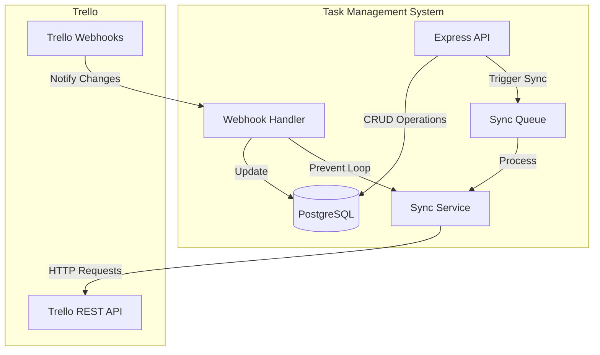
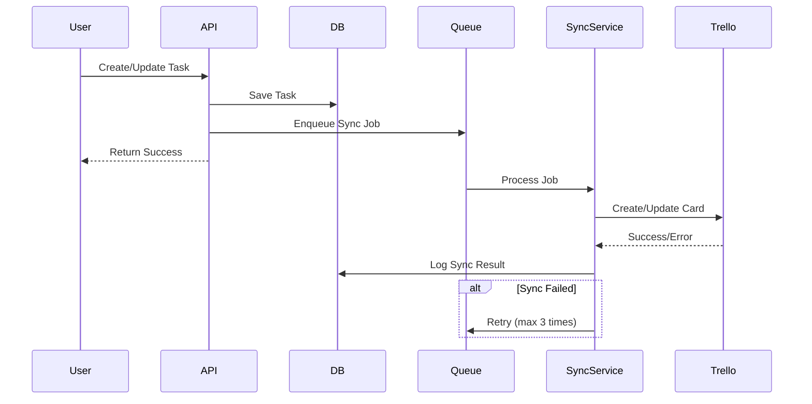
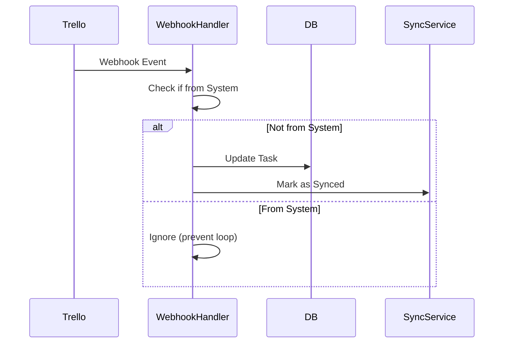

# Design Document: Trello Integration Auto-Update

## Overview

ฟีเจอร์นี้เป็นการเชื่อมต่อระบบบริหารจัดการงาน (Task Management System) กับ Trello เพื่อให้ข้อมูลงานและความคืบหน้าถูกซิงค์ไปยัง Trello board อัตโนมัติ ช่วยให้ทีมงานสามารถติดตามสถานะงานผ่าน Trello ได้แบบเรียลไทม์โดยไม่ต้องอัปเดตข้อมูลด้วยตนเอง

### Key Features

- เชื่อมต่อกับ Trello API ผ่าน API Key และ Token
- สร้าง Trello card อัตโนมัติเมื่อมีการสร้างงานใหม่
- ซิงค์ข้อมูลพื้นฐาน: ชื่องาน, คำอธิบาย, วันกำหนดส่ง
- ซิงค์ผู้รับผิดชอบงาน (task assignments) เป็น Trello members
- ซิงค์ checklist และความคืบหน้า
- ซิงค์สถานะงานโดยย้าย card ระหว่าง lists
- อัปเดตอัตโนมัติเมื่อมีการเปลี่ยนแปลงในระบบ
- รองรับการซิงค์แบบสองทาง (two-way sync) ผ่าน webhooks (optional)
- บันทึก log การซิงค์เพื่อการตรวจสอบและแก้ไขปัญหา

### Design Goals

1. **Reliability**: ระบบต้องซิงค์ข้อมูลได้อย่างน่าเชื่อถือ มี retry mechanism เมื่อเกิดข้อผิดพลาด
2. **Performance**: การซิงค์ต้องเสร็จภายใน 5 วินาทีหลังจากมีการเปลี่ยนแปลง
3. **Security**: API credentials ต้องถูกเข้ารหัสก่อนเก็บในฐานข้อมูล
4. **Maintainability**: แยก sync logic ออกเป็น service ที่สามารถทดสอบและบำรุงรักษาได้ง่าย
5. **Observability**: บันทึก log ทุกการซิงค์เพื่อให้สามารถตรวจสอบและแก้ไขปัญหาได้

## Architecture

### System Components



### Component Responsibilities

1. **Express API**: รับ HTTP requests จาก frontend และดำเนินการ CRUD operations กับฐานข้อมูล
2. **Sync Service**: จัดการการซิงค์ข้อมูลไปยัง Trello API รวมถึง retry logic
3. **Sync Queue**: คิวสำหรับจัดการ sync jobs เพื่อไม่ให้ blocking API requests
4. **Webhook Handler**: รับ webhook events จาก Trello และอัปเดตข้อมูลในระบบ (สำหรับ two-way sync)
5. **PostgreSQL Database**: เก็บข้อมูลงาน, การตั้งค่า Trello, mappings และ sync logs

### Data Flow

#### One-Way Sync (System → Trello)



#### Two-Way Sync (Trello → System)



## Components and Interfaces

### 1. Trello Configuration Service

จัดการการตั้งค่าและ credentials สำหรับ Trello integration

```typescript
interface TrelloConfig {
  apiKey: string;
  token: string;
  boardId: string;
  enableAutoSync: boolean;
  enableTwoWaySync: boolean;
}

class TrelloConfigService {
  async saveConfig(config: TrelloConfig): Promise<void>;
  async getConfig(): Promise<TrelloConfig | null>;
  async validateCredentials(apiKey: string, token: string): Promise<boolean>;
  async testConnection(): Promise<{ success: boolean; message: string }>;
  async getBoardLists(boardId: string): Promise<TrelloList[]>;
}
```

### 2. Trello API Client

Wrapper สำหรับ Trello REST API

```typescript
interface TrelloCard {
  id: string;
  name: string;
  desc: string;
  due: string | null;
  idList: string;
  idMembers: string[];
  labels: TrelloLabel[];
}

interface TrelloList {
  id: string;
  name: string;
  pos: number;
}

interface TrelloChecklist {
  id: string;
  name: string;
  checkItems: TrelloCheckItem[];
}

interface TrelloCheckItem {
  id: string;
  name: string;
  state: 'complete' | 'incomplete';
}

class TrelloAPIClient {
  constructor(apiKey: string, token: string);
  
  // Card operations
  async createCard(data: CreateCardData): Promise<TrelloCard>;
  async updateCard(cardId: string, data: UpdateCardData): Promise<TrelloCard>;
  async deleteCard(cardId: string): Promise<void>;
  async getCard(cardId: string): Promise<TrelloCard>;
  
  // Member operations
  async addMemberToCard(cardId: string, memberId: string): Promise<void>;
  async removeMemberFromCard(cardId: string, memberId: string): Promise<void>;
  
  // Checklist operations
  async createChecklist(cardId: string, name: string): Promise<TrelloChecklist>;
  async addCheckItem(checklistId: string, name: string): Promise<TrelloCheckItem>;
  async updateCheckItem(cardId: string, checkItemId: string, state: 'complete' | 'incomplete'): Promise<void>;
  async deleteCheckItem(checklistId: string, checkItemId: string): Promise<void>;
  
  // Label operations
  async addLabelToCard(cardId: string, labelId: string): Promise<void>;
  async removeLabelFromCard(cardId: string, labelId: string): Promise<void>;
  
  // Board operations
  async getBoardLists(boardId: string): Promise<TrelloList[]>;
  async getBoardMembers(boardId: string): Promise<TrelloMember[]>;
  
  // Webhook operations
  async createWebhook(callbackUrl: string, idModel: string): Promise<TrelloWebhook>;
  async deleteWebhook(webhookId: string): Promise<void>;
}
```

### 3. Sync Service

จัดการการซิงค์ข้อมูลระหว่างระบบกับ Trello

```typescript
interface SyncJob {
  taskId: number;
  action: 'create' | 'update' | 'delete' | 'sync_checklist' | 'sync_members';
  retryCount: number;
  maxRetries: number;
}

interface SyncResult {
  success: boolean;
  error?: string;
  trelloCardId?: string;
}

class TrelloSyncService {
  private apiClient: TrelloAPIClient;
  private queue: SyncQueue;
  
  // Main sync methods
  async syncTask(taskId: number): Promise<SyncResult>;
  async syncTaskCreation(task: Task): Promise<SyncResult>;
  async syncTaskUpdate(task: Task, changes: TaskChanges): Promise<SyncResult>;
  async syncTaskDeletion(taskId: number, trelloCardId: string): Promise<SyncResult>;
  
  // Specific sync operations
  async syncBasicInfo(task: Task, cardId: string): Promise<void>;
  async syncMembers(task: Task, cardId: string): Promise<void>;
  async syncChecklist(task: Task, cardId: string): Promise<void>;
  async syncStatus(task: Task, cardId: string): Promise<void>;
  async syncLabels(task: Task, cardId: string): Promise<void>;
  
  // Queue management
  async enqueueSync(job: SyncJob): Promise<void>;
  async processQueue(): Promise<void>;
  
  // Retry logic
  private async retrySync(job: SyncJob): Promise<SyncResult>;
  private async handleSyncError(job: SyncJob, error: Error): Promise<void>;
}
```

### 4. Webhook Handler

จัดการ webhook events จาก Trello (สำหรับ two-way sync)

```typescript
interface WebhookEvent {
  action: {
    type: string;
    data: any;
  };
  model: {
    id: string;
  };
}

class TrelloWebhookHandler {
  async handleWebhook(event: WebhookEvent): Promise<void>;
  
  private async handleCardUpdate(cardId: string, data: any): Promise<void>;
  private async handleCheckItemStateChange(cardId: string, checkItemId: string, state: string): Promise<void>;
  private async handleMemberAdded(cardId: string, memberId: string): Promise<void>;
  private async handleMemberRemoved(cardId: string, memberId: string): Promise<void>;
  
  // Prevent infinite loop
  private isFromSystem(event: WebhookEvent): boolean;
  private markAsProcessed(eventId: string): void;
}
```

### 5. Mapping Service

จัดการการเชื่อมโยงระหว่างข้อมูลในระบบกับ Trello

```typescript
interface StatusListMapping {
  status: 'pending' | 'in_progress' | 'completed' | 'cancelled';
  trelloListId: string;
}

interface UserMemberMapping {
  userId: number;
  trelloMemberId: string;
}

class TrelloMappingService {
  // Status-List mappings
  async saveStatusMapping(mapping: StatusListMapping): Promise<void>;
  async getStatusMapping(status: string): Promise<string | null>;
  async getAllStatusMappings(): Promise<StatusListMapping[]>;
  
  // User-Member mappings
  async saveUserMapping(mapping: UserMemberMapping): Promise<void>;
  async getUserMapping(userId: number): Promise<string | null>;
  async getAllUserMappings(): Promise<UserMemberMapping[]>;
  
  // Priority-Label mappings
  async getPriorityLabel(priority: string): Promise<string | null>;
}
```

## Data Models

### Database Schema

```sql
-- Trello configuration table
CREATE TABLE trello_config (
  id SERIAL PRIMARY KEY,
  api_key_encrypted TEXT NOT NULL,
  token_encrypted TEXT NOT NULL,
  board_id TEXT NOT NULL,
  board_url TEXT,
  enable_auto_sync BOOLEAN DEFAULT true,
  enable_two_way_sync BOOLEAN DEFAULT false,
  webhook_id TEXT,
  webhook_url TEXT,
  created_at TIMESTAMP DEFAULT CURRENT_TIMESTAMP,
  updated_at TIMESTAMP DEFAULT CURRENT_TIMESTAMP
);

-- Task-Card mapping table
CREATE TABLE trello_card_mappings (
  id SERIAL PRIMARY KEY,
  task_id INTEGER NOT NULL REFERENCES tasks(id) ON DELETE CASCADE,
  trello_card_id TEXT NOT NULL UNIQUE,
  trello_card_url TEXT,
  created_at TIMESTAMP DEFAULT CURRENT_TIMESTAMP,
  updated_at TIMESTAMP DEFAULT CURRENT_TIMESTAMP,
  UNIQUE(task_id)
);

-- Status-List mapping table
CREATE TABLE trello_status_mappings (
  id SERIAL PRIMARY KEY,
  status TEXT NOT NULL UNIQUE CHECK(status IN ('pending', 'in_progress', 'completed', 'cancelled')),
  trello_list_id TEXT NOT NULL,
  trello_list_name TEXT,
  created_at TIMESTAMP DEFAULT CURRENT_TIMESTAMP
);

-- User-Member mapping table
CREATE TABLE trello_user_mappings (
  id SERIAL PRIMARY KEY,
  user_id INTEGER NOT NULL REFERENCES users(id) ON DELETE CASCADE,
  trello_member_id TEXT NOT NULL,
  trello_username TEXT,
  created_at TIMESTAMP DEFAULT CURRENT_TIMESTAMP,
  UNIQUE(user_id)
);

-- Sync logs table
CREATE TABLE trello_sync_logs (
  id SERIAL PRIMARY KEY,
  task_id INTEGER REFERENCES tasks(id) ON DELETE SET NULL,
  trello_card_id TEXT,
  action TEXT NOT NULL CHECK(action IN ('create', 'update', 'delete', 'sync_checklist', 'sync_members', 'sync_status')),
  status TEXT NOT NULL CHECK(status IN ('pending', 'success', 'failed', 'retrying')),
  error_message TEXT,
  retry_count INTEGER DEFAULT 0,
  request_payload JSONB,
  response_payload JSONB,
  created_at TIMESTAMP DEFAULT CURRENT_TIMESTAMP,
  completed_at TIMESTAMP
);

-- Create index for performance
CREATE INDEX idx_sync_logs_task_id ON trello_sync_logs(task_id);
CREATE INDEX idx_sync_logs_status ON trello_sync_logs(status);
CREATE INDEX idx_sync_logs_created_at ON trello_sync_logs(created_at);
CREATE INDEX idx_card_mappings_task_id ON trello_card_mappings(task_id);
CREATE INDEX idx_card_mappings_trello_card_id ON trello_card_mappings(trello_card_id);
```

### TypeScript Interfaces

```typescript
// Database models
interface TrelloConfig {
  id: number;
  api_key_encrypted: string;
  token_encrypted: string;
  board_id: string;
  board_url?: string;
  enable_auto_sync: boolean;
  enable_two_way_sync: boolean;
  webhook_id?: string;
  webhook_url?: string;
  created_at: Date;
  updated_at: Date;
}

interface TrelloCardMapping {
  id: number;
  task_id: number;
  trello_card_id: string;
  trello_card_url?: string;
  created_at: Date;
  updated_at: Date;
}

interface TrelloStatusMapping {
  id: number;
  status: 'pending' | 'in_progress' | 'completed' | 'cancelled';
  trello_list_id: string;
  trello_list_name?: string;
  created_at: Date;
}

interface TrelloUserMapping {
  id: number;
  user_id: number;
  trello_member_id: string;
  trello_username?: string;
  created_at: Date;
}

interface TrelloSyncLog {
  id: number;
  task_id?: number;
  trello_card_id?: string;
  action: 'create' | 'update' | 'delete' | 'sync_checklist' | 'sync_members' | 'sync_status';
  status: 'pending' | 'success' | 'failed' | 'retrying';
  error_message?: string;
  retry_count: number;
  request_payload?: any;
  response_payload?: any;
  created_at: Date;
  completed_at?: Date;
}
```

