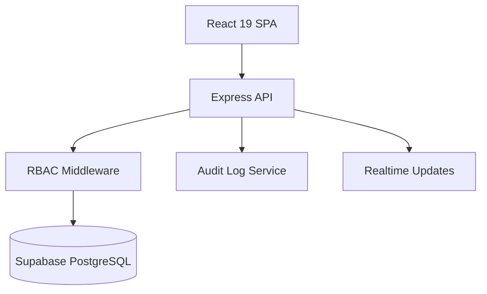

# Intersite-Track — Enterprise Task & Project Management

> **Enterprise-grade task & project management** — role-based access control, audit trails, cross-team tracking.

### Demo

> 🎬 **Demo coming soon** — screen capture will be added at `docs/demo.gif`

### Architecture

### Results

| Metric | Value |
|---|---|
| **RBAC** | Role-based access + audit trail |
| **Frontend** | React 19 + TypeScript |
| **Backend** | Express + Supabase |

---

**Phirawit Jitnarong — Strategic Full-Stack & AI Engineer**

xme176@gmail.com · 092-551-0427 · [LinkedIn](https://www.linkedin.com/in/%E0%B8%9E%E0%B8%B5%E0%B8%A3%E0%B8%A7%E0%B8%B4%E0%B8%8A%E0%B8%8D%E0%B9%8C-%E0%B8%88%E0%B8%B4%E0%B8%95%E0%B8%93%E0%B8%A3%E0%B8%87%E0%B8%84%E0%B9%8C-0000393a4) · [Fastwork](https://fastwork.co/user/bravforcode?source=search)

> Hiring for this stack? Let's talk — production hardened, 300k+ users shipped.